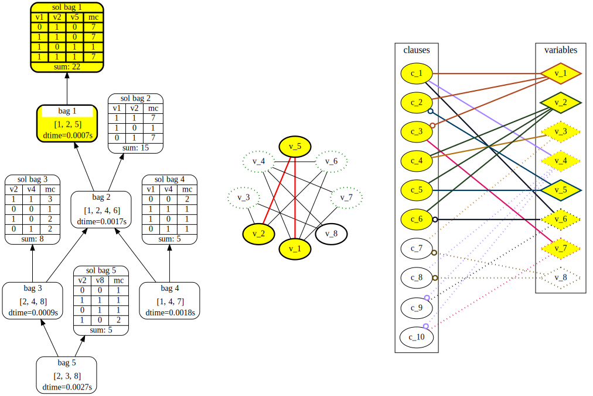

# TdVisu

 
[](https://pypi.python.org/pypi/tdvisu/)


[](https://pypi.python.org/pypi/tdvisu/)
[](https://pypi.python.org/pypi/tdvisu/)
[](https://pypi.python.org/pypi/tdvisu/)


Visualization for [dynamic programming](https://en.wikipedia.org/wiki/Dynamic_programming) on [tree decompositions](https://en.wikipedia.org/wiki/Tree_decomposition).
Create a graph object for each desired graph that is of interest for the dynamic programming.
Then the visualization generates highlights and adds additional solutions for user-defined time steps.
These snapshots of graphs get written in a supported file-format to a any folder.
For the portable and light weight '.svg' format, all graphs for a timestep can be joined together to provide a thoroughly view on the process of dynamic programming.

With the '.svg' the images are highly customizable, and even combining several timesteps together using svg [animate](https://developer.mozilla.org/en-US/docs/Web/SVG/Element/animate) would be an option.


# Using
[Alubbock:Graphviz](https://anaconda.org/alubbock/graphviz) (or [Graphviz (>=2.38)](https://graphviz.gitlab.io/download/))

[python-benedict](https://pypi.org/project/python-benedict/)

[for dpdb: psycopg2 (2.8.5)](https://www.psycopg.org/docs/index.html)

# How to install

After downloading the latest verion, go to the source-directory. 

With [Conda](https://docs.conda.io/en/latest/) on the system installed, the dependencies for this project can be automatically installed in a new environment - or in a place of your choosing:

Open a *conda-command-prompt* with admin privileges and run the commands from the *gpusat-VISU\tdvisualization_repo* folder:
```shell
conda env create -f .\environment.yml
```
to create a new environment with basic dependencies
```shell
conda activate tdvisu
```
to activate the environment
```shell
dot.exe -c
```
to register the plugins
```shell
pip install --pre .
```
to install the project in the environment (currently in pre-release, to get *pip* see: https://anaconda.org/anaconda/pip)
```shell
python .\tdvisu\visualization.py -h
```
to confirm that the visualization finds all dependencies.
```shell
pip install .[test] 
python -m unittest
```
to run all tests.


# How to use

The visualization needs input in the form of the [Json API](https://github.com/VaeterchenFrost/gpusat-VISU/blob/master/JsonAPI_v1.3.md).
The creation of this file is exemplary implemented in *construct_dpdb_visu.py* or the fork [GPUSAT](https://github.com/VaeterchenFrost/GPUSAT) and *--visufile filename* (optionally disabling preprocessing with *-p*).

Run the python file with the above dependencies installed:
[visualization.py](https://github.com/VaeterchenFrost/gpusat-VISU/blob/master/satvisualization_repo/satvisu/visualization.py)

**visualization.py** takes two parameters, the json-**infile** to read from, and optionally one **outputfolder**.
With both arguments a call from IPython might look like this:

```python
runfile('visualization.py', 
args='visugpusat.json examplefolder')
```

For #SAT it produces for example three different graphs suffixed with a running integer to represent timesteps:

+ *TDStep* the tree decomposition with solved nodes
+ *PrimalGraphStep* the primal graph with currently active variables highlighted
+ *IncidenceGraphStep* the bipartite incidence graph with active clauses/variables highlighted

The graphs are images encoded in resolution independent **.svg files** (see https://www.lifewire.com/svg-file-4120603)

## How to use construct_dpdb_visu.py
After installing the project [dp_on_dbs](https://github.com/hmarkus/dp_on_dbs) with the there listed [requirements](https://github.com/hmarkus/dp_on_dbs#requirements), we need to
- edit the [database.ini](https://github.com/VaeterchenFrost/tdvisu/blob/master/tdvisu/database.ini) with our password to [postgresql](https://www.postgresql.org/)
- Solve a problem with `python dpdb.py [GENERAL-OPTIONS] -f <INPUT-FILE> <PROBLEM> [PROBLEM-SPECIFIC-OPTIONS]`
  - for the problem **VertexCover** 
    - with flag `--gr-file` to store the htd Input (if the input was in a different format)
  - for the problem **SharpSat**
    - with flag `--store-formula` to store the formula in the database
- Run 
  - **SharpSat**: `python construct_dpdb_visu.py [PROBLEMNUMBER]`
  - **VertexCover**: `python construct_dpdb_visu.py [PROBLEMNUMBER] --twfile [TWFILE]` 
   with the file in DIMACS tw-format containing the edges of the graph.
  


